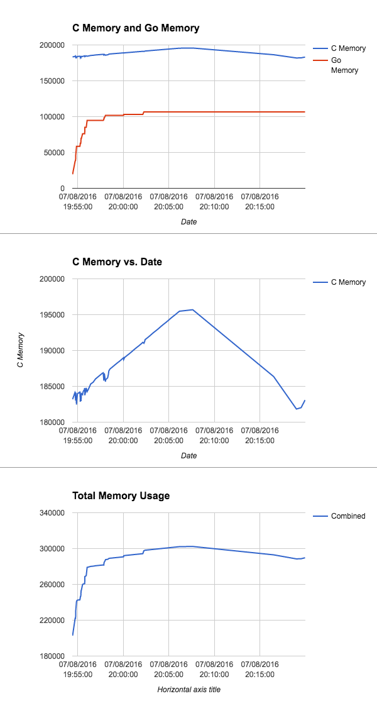

Watch a CGO Process's Memory
============================

To track the C, Go, and combined memory usage of a Go service using CGO and with PPROF enabled, 
pass the PID and PPROF base URL into `watch_cgo_memory`, and then copy/paste into a spreadsheet
for graphing.

    watch_cgo_memory() {
        PID=$1
        PPROF_URL=$2
        C_USAGE=
        printf "Date\tC Memory\tGo Memory\tRSS\n"
        while true; do
            RSS=$(cat "/proc/${PID}/status" | grep VmRSS | sed -e 's/VmRSS:[ \t]*//g' | sed -e 's/ kB//g')
            GO_HEAP=$(curl -s "${PPROF_URL}/debug/pprof/heap" \
              | grep '# Sys =' | sed -e 's/.\+= //g' | sed -e 's/[0-9]\{3\}$//')
            NEW_C_USAGE=$(( $RSS - $GO_HEAP ))
                if [ "${C_USAGE}" != "${NEW_C_USAGE}" ]; then
                    C_USAGE=$NEW_C_USAGE
                    DATE=$(date +"%m/%d/%Y %H:%M:%S")
                    echo -e "${DATE}\t${C_USAGE}\t${GO_HEAP}\t${RSS}"
            fi
            sleep 1
        done
    }
    watch_cgo_memory 26032 http://127.0.0.1:12345

Here's an example of a few quick graphs generated with Google Sheets: 

