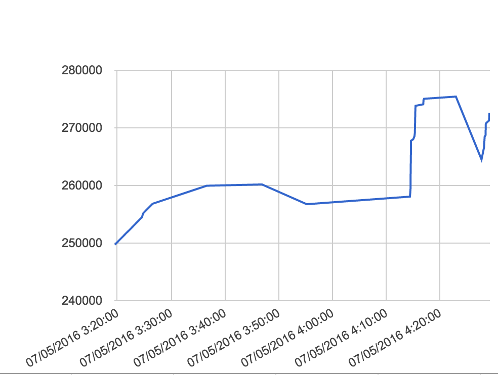

Watch a PID's Memory Usage
==========================

Here's a crude way to watch a process's memory usage:

    PID=12345
    RSS=
    while true; do
        NEW_RSS=$(cat "/proc/${PID}/status" | grep VmRSS | sed -e 's/VmRSS:[ \t]*//g' | sed -e 's/ kB//g')
            if [ "${RSS}" != "${NEW_RSS}" ]; then
                RSS=$NEW_RSS
                DATE=$(date +"%m/%d/%Y %H:%M:%S")
                echo -e "${DATE}\t${RSS}"
        fi
        sleep 1
    done

It keeps checking the [RSS memory](https://en.wikipedia.org/wiki/Resident_set_size) for a process, 
outputting: `<date><tab><rss in kb>`, which can be copy/pasted into [Google Sheets](https://sheets.google.com),
and used to generate a graph like this:
.
